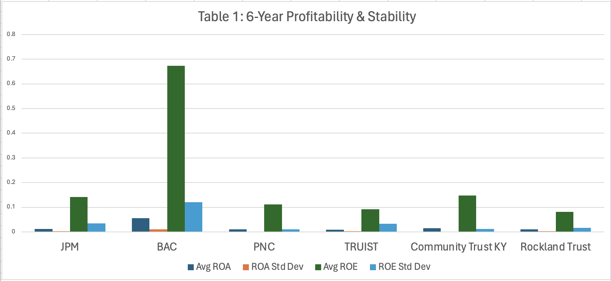
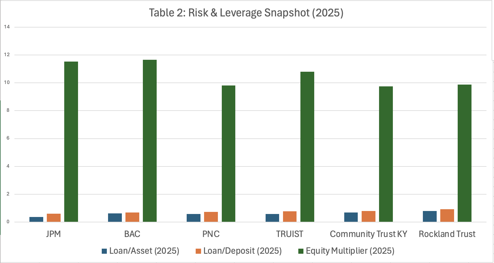
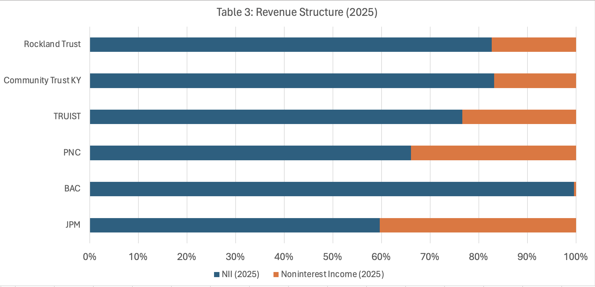

# U.S. Banking Sector Financial Analysis (2020–2025)


## Project Overview
This project analyzes the financial performance, profitability, and risk structure of major U.S. commercial banks between 2020 and 2025. The analysis compares institutions across different banking tiers to identify structural differences in profitability, revenue composition, and leverage.

The study focuses on six banks representing different segments of the U.S. banking system:

- JPMorgan Chase
- Bank of America
- PNC Financial Services
- Truist Financial
- Community Trust Bank
- Rockland Trust

Using financial statement data, key performance ratios were calculated and compared to understand how scale, diversification, and leverage influence financial performance in the banking industry.

---

## Objectives
The main objectives of this project are:

- Evaluate profitability differences across large national banks and regional/community banks
- Analyze revenue structure between interest and non-interest income
- Assess financial risk through leverage and asset utilization ratios
- Identify structural characteristics that differentiate banking tiers

---

## Key Financial Metrics Analyzed

The following financial ratios were calculated and analyzed:

### Profitability Metrics
- **Return on Assets (ROA)**  
  Measures how efficiently a bank uses its assets to generate profit.

- **Return on Equity (ROE)**  
  Measures profitability relative to shareholder equity.

### Revenue Structure
- **Net Interest Income (NII)**  
  Income generated from lending activities.

- **Noninterest Income**  
  Revenue from services such as investment banking, trading, and fees.

### Risk and Leverage Metrics
- **Loan-to-Asset Ratio**  
  Measures asset allocation toward lending.

- **Loan-to-Deposit Ratio**  
  Indicates liquidity risk and funding structure.

- **Equity Multiplier**  
  Measures financial leverage.

---

## Analytical Methodology

This project applies structured financial ratio analysis to evaluate profitability, leverage, liquidity risk, and revenue diversification across different tiers of U.S. commercial banks.

The analytical framework combines traditional banking performance metrics with the **DuPont decomposition model** to identify the key drivers of bank profitability.

---

### DuPont ROE Decomposition

Return on Equity (ROE) is decomposed using the **DuPont framework**, which separates profitability, operational efficiency, and leverage effects.

ROE is calculated as:

ROE = Net Profit Margin × Asset Turnover × Equity Multiplier

Where:

Net Profit Margin = Net Income / Total Revenue  
Asset Turnover = Total Revenue / Total Assets  
Equity Multiplier = Total Assets / Total Equity  

This decomposition allows the analysis to determine whether differences in ROE across banks are primarily driven by profitability margins, asset utilization, or financial leverage.

---

### Financial Performance Metrics

The following financial ratios were calculated to evaluate bank performance:
```
| Metric                   | Formula                            | Purpose                                                            |
| ------------------------ | ---------------------------------- | ------------------------------------------------------------------ |
| Return on Assets (ROA)   | Net Income / Total Assets          | Measures how efficiently a bank generates profit from its assets   |
| Return on Equity (ROE)   | Net Income / Total Equity          | Measures shareholder return and overall profitability              |
| Loan-to-Asset Ratio      | Total Loans / Total Assets         | Indicates the proportion of assets allocated to lending activities |
| Loan-to-Deposit Ratio    | Total Loans / Total Deposits       | Measures lending intensity and potential liquidity risk            |
| Noninterest Income Ratio | Noninterest Income / Total Revenue | Evaluates revenue diversification beyond traditional lending       |
```
---

### Analytical Approach

The analysis follows a structured workflow:

1. Financial statement data was collected from publicly available sources including SEC filings and bank financial reports.

2. Key financial variables were organized into a structured dataset to allow cross-bank comparisons.

3. Financial ratios were calculated using Excel-based financial modeling.

4. Comparative analysis and visualizations were developed to identify structural differences in profitability, leverage, and revenue composition across banking tiers.

This methodology enables a consistent comparison of financial performance across **money-center banks, super-regional banks, and community banks**.

## Data Sources

The analysis uses financial statement data from the following sources:

- SEC filings (10-K reports)
- Federal Reserve financial databases
- Bank annual reports

The dataset includes financial metrics extracted and structured into multiple tables for analysis.

---

## Repository Structure
```
us-banking-sector-financial-analysis
│
├── analysis
│ └── bank_financial_model_2020_2025.xlsx
│
├── data
│ ├── RawData.csv
│ ├── CalculatedRatio.csv
│ └── Analysis Results.csv
│
├── report
│ └── us-banking-sector-financial-analysis-report-2020-2025.pdf
│
├── presentation
│ └── us-banking-sector-financial-analysis-presentation-2020-2025.pdf
│
├── visuals
│ ├── profitability_roa_roe_comparison.png
│ ├── revenue_structure_comparison.png
│ └── risk_leverage_metrics.png
│
├── README.md
└── LICENSE
```

---

## Analytical Visualizations

### Profitability Comparison

This chart compares Return on Assets (ROA) and Return on Equity (ROE) across the selected banks.



Key insight:  
Large national banks tend to demonstrate stronger profitability due to scale advantages and diversified revenue streams.

---

### Revenue Structure Comparison

This visualization compares Net Interest Income and Noninterest Income across banks.



Key insight:  
Money-center banks rely more heavily on diversified revenue sources, while community banks remain highly dependent on lending income.

---

### Risk and Leverage Metrics

This chart analyzes structural differences in leverage and lending intensity.



Key insight:  
Smaller banks often maintain higher loan concentration ratios, which can increase exposure to credit risk but may also improve lending profitability.

---

## Key Findings

Several structural patterns emerge from the analysis:

1. **Scale advantages matter**  
   Large banks benefit from diversified income streams and operational scale.

2. **Community banks remain lending-focused**  
   Smaller banks rely heavily on interest income from loans.

3. **Leverage structures vary significantly across tiers**  
   Larger banks often operate with different capital structures and regulatory frameworks.

4. **Revenue diversification improves resilience**  
   Banks with broader income sources are less exposed to interest rate fluctuations.

---

## Tools Used

The analysis was conducted using the following tools:

- **Microsoft Excel** — financial modeling and ratio calculations
- **Data Visualization** — financial comparison charts
- **GitHub** — version control and project documentation

---

## Academic Context

This project was completed as part of the **FIN 432 – Risk Management & Financial Institutions** course. The analysis focuses on understanding financial structure and performance across different tiers of the U.S. banking system.

---

## Author

**Benedict Daxell Santoso**  
Business Analytics & Information Systems  
Suffolk University

LinkedIn:  
https://www.linkedin.com/in/benedictdaxellsantoso/

---

## Future Improvements

Potential extensions of this project include:

- Time-series trend analysis of bank performance
- Integration with Python or R for automated financial analysis
- Expansion of the dataset to include additional U.S. banks
- Development of interactive dashboards for financial comparisons
